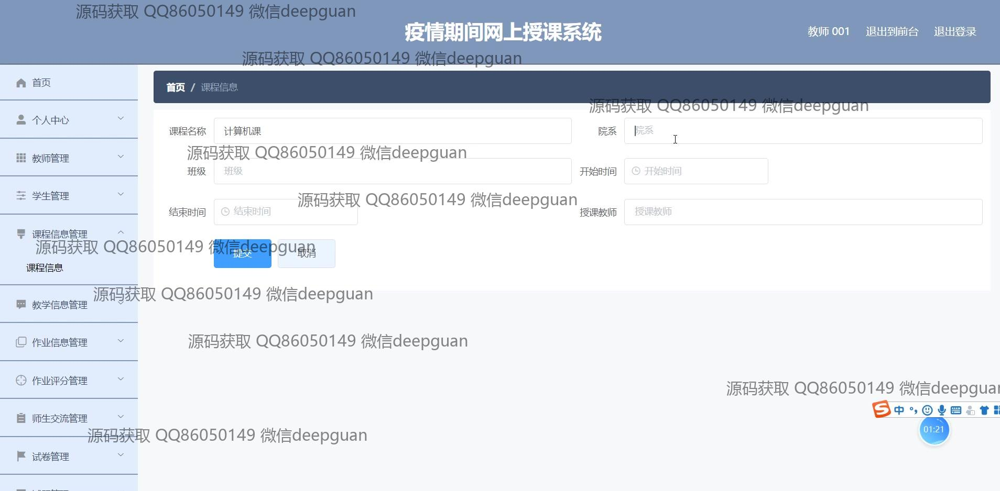
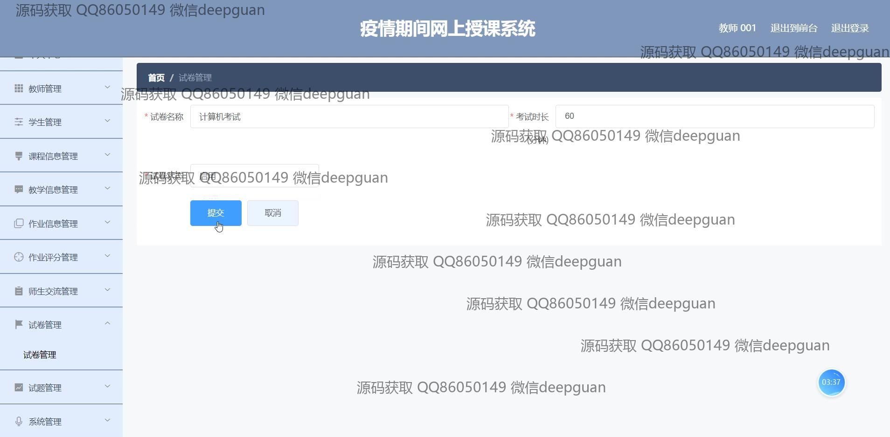
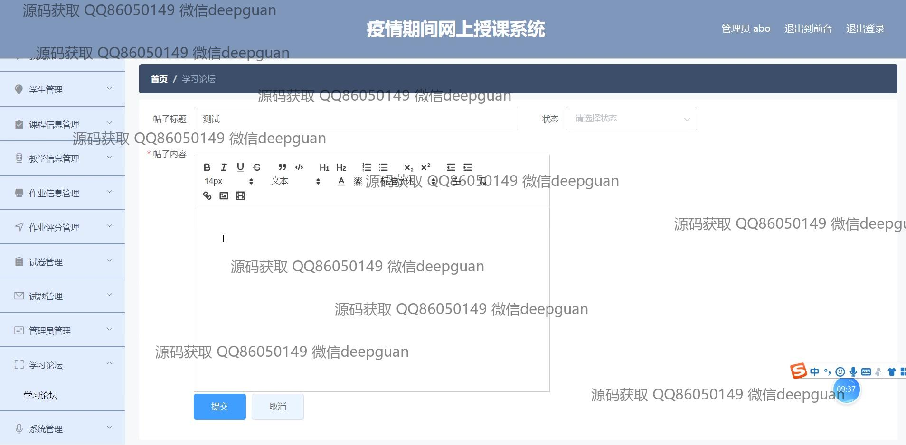

<h1 align="center">在线教学课堂发网上授课系统vue</h1>

## 简介
在线教学课堂系统：功能包括课程列表展示、实时视频授课、互动聊天、作业提交与批改、教师与学生管理、考试和试题管理、公告信息管理、学习论坛互动，以及注册与登录功能。    --计算机毕业设计源码；毕设源码；java毕业设计源码

## 联系方式

<h3 align="center">获取完整代码与数据库文件 + 微信：deepguan QQ: 86050149 QQ群: 783742310</h3>

<h3 align="center">可帮忙远程部署 包运行成功！提供远程部署、修改代码、设计文档指导、代码讲解等服务！</h3>

## 功能介绍（完整见运行截图）
管理员：负责系统的整体管理，包括用户角色的分配、系统配置、公告管理、文件上传及内容编辑，同时能控制首页导航、学习论坛、试卷列表和网站公告的内容，以及防范信息泄露的账号安全和退出机制。  

教师：能够注册、登录和管理个人及学生信息，进行课程列表的发布、教学视频上传和作业评分管理，可以输入试题和试卷信息并设置考试参数，参与与学生和管理员的互动交流，同时监控学习论坛和公告内容的更新。  

学生：通过注册和登录访问系统，查看课程列表，参与实时视频授课和互动聊天，提交作业和查看评分，能够下载教学资料和作业，同时参与学习论坛，与教师和其他学生进行交流，并查看网站公告。  

系统用户（包括管理员和教师）：提供整体管理功能，支持教师、学生和课程信息的录入和维护，允许试题和考试记录管理，方便使用文件上传和文本编辑工具以更新教学内容，能及时发布和管理系统公告。

## 运行截图

本代码来源于网络,仅供学习参考使用!

